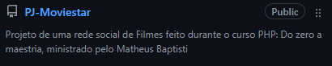

# Welcome

Olá, me chamo **João Pedro Sassi Granado** e atualmente sou desenvolvedor júnior na **Consiglog**
***

## Um pouco sobre mim
Tenho apreço por tecnologia desde que consigo me lembrar. Estou sempre querendo aprender coisas novas, buscando aprimorar meus conhecimentos em tecnologia
### Formação Acadêmica
- Técnico em Informática para Internet integrado ao EM - Etec MCM
- 3/6 cursado de Análise e Desenvolvimento de Sistemas - FATEC SCS
- Atualmente cursando Desenvolvimento de Sofware Multiplaraforma - FATEC Mauá

## Repositórios com exercícios
Aqui no meu Github eu adotei um estilo de repositórios. Basicamente meus repostórios seguem um padrão no nome, que seria:
1. Nome do curso separado por underline
2. Traço (-)
3. Nome abreviado do provedor (EX: HC-Hora de Codar)

Esses repositórios guadrarão todos os Exercícios e Desafios feitos no curso, mostrando como eu realmente os fiz. Quanto aos projetos:

## Projetos 
Tal qual os repositórios de exercícios, os de projetos também seguem um padrão. Esse padrão seria:
1. PJ (Vem de Project)
2. Traço (-)
3. Nome do projeto 

Exemplo:

***
## Entre em Contato
Caso queira entrar em contato, minhas redes sociais estão abaixo, basta clicar nos ícones, ou me mandar um E-Mail.

   

Email: <a href="mailto:joaopedro10813@gmail.com">joaopedro10813@gmail.com</a>

***
